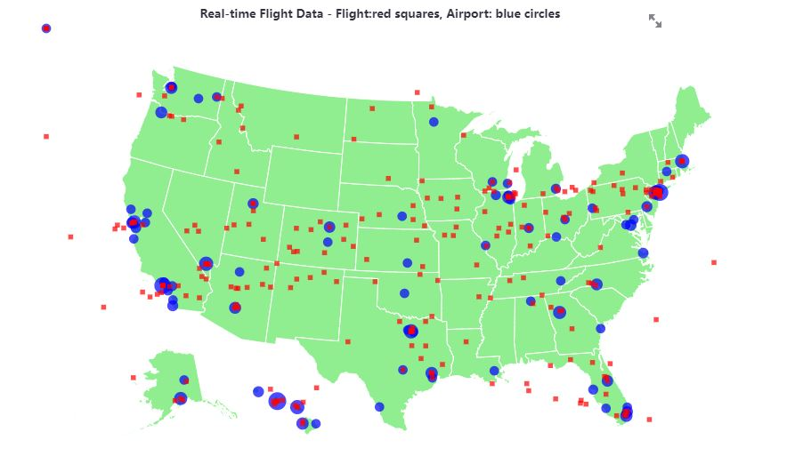
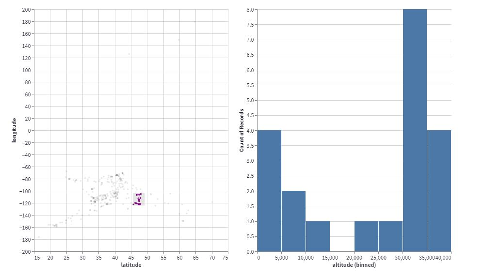
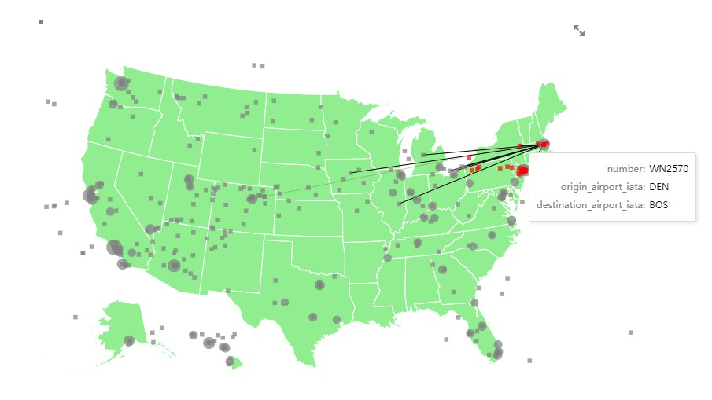
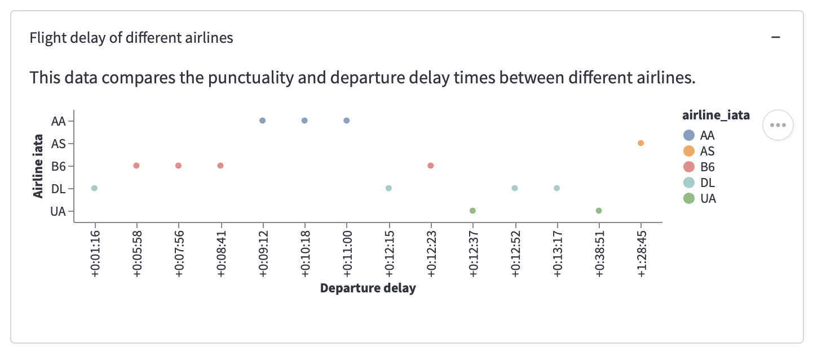
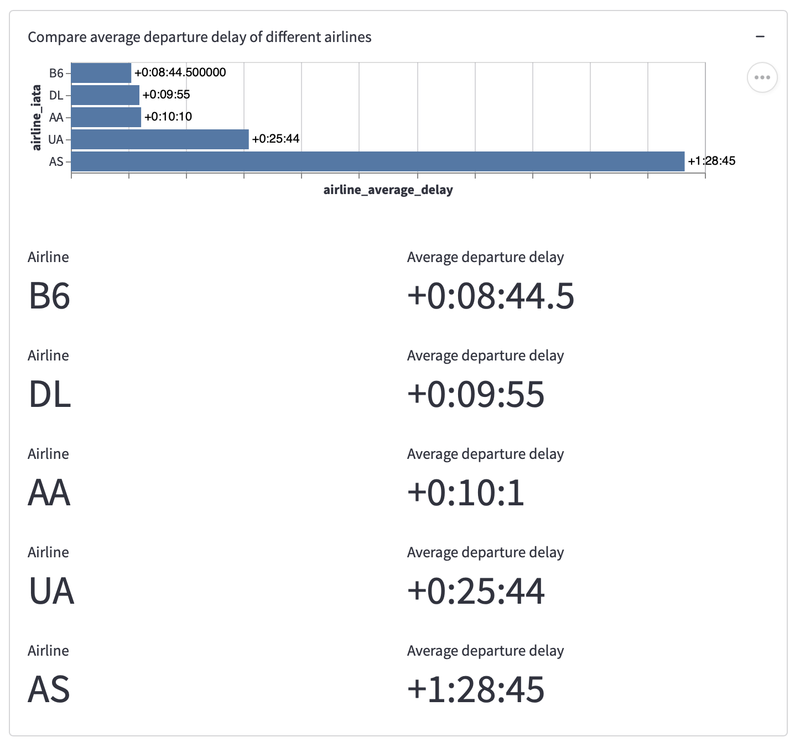
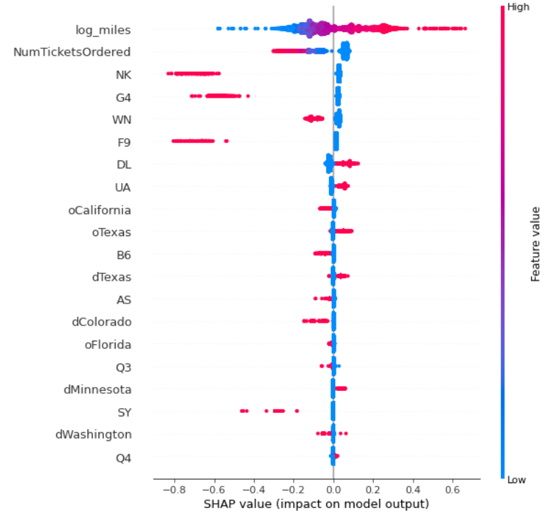
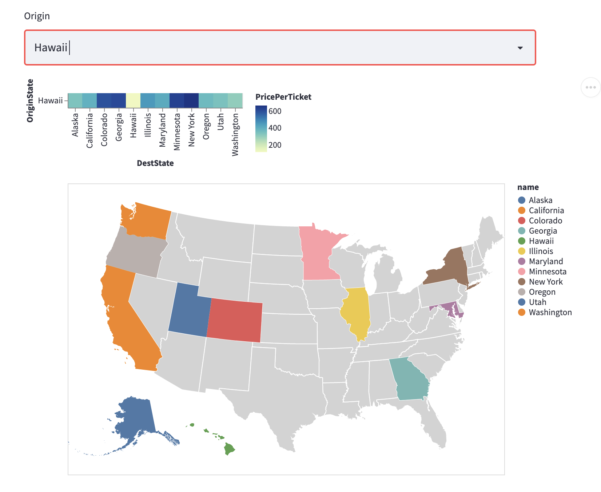
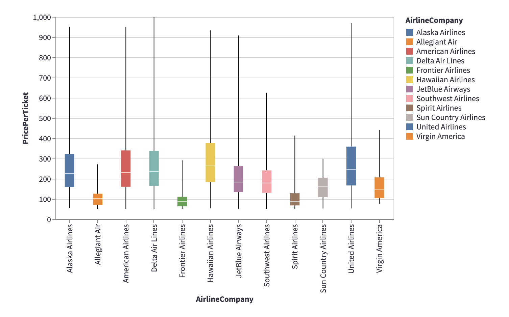

# Final Project Report

**Project URL**:  https://share.streamlit.io/cmu-ids-2022/final-project-flight-traffic-brain/main


Short (~250 words) abstract of the concrete data science problem and how the solutions addresses the problem.

Nowadays, air traffic control has become a complicated task as there are more and more flights and airlines. There has also been rising cases of flight delays possibly due to poor management and massive volume of traffic. While air traffic is important to manage from the perspective of airports and airlines, flight prices are crucial for customers who usually make decisions of their travel plans based on them. In this project we hope to help airports better manage airlines and control airline traffic and passengers make wiser decisions about airline flights. Our exploration will be centered around 4 directions to offer help for both airports and passengers:


1. **Design for Airports**
    1) Create a flight network graph to visualize the connections between airports and flights
    2) Develop a visualization tool to analyze potential delay time of certain flights

2. **Design for Passengers**
    1) Develop a ML model to predict flight prices
    2) Provide passengers with flight planning recommendations based on information about major origin/destination states and flights using historical data


## Introduction
Nowadays, air traffic control has become a complicated task as there are more and more flights and airlines. Because of the dependencies between flights, a delay in one can cause delays in other flights if they are not properly managed. An interactive data science solution can help alleviate this problem. A real-time map of flights with interactive information such as speed and altitude can help the specialists to make better decisions. Meanwhile, an interactive network graph that shows the connections between airports and flights can also improve the handling of dependencies among the traffic.

Besides the real-time interactive network graph, we also developed a data visualization section to enable users to analyze the delay time of different flights in real time and in more detail. By filtering the flight according to their departure airport, the users can not only view the delay time of different flights, but also have a high-level overview of the delay information of flights of different airlines. This information can help airport specialists to better communicate with the airports and passengers, and make better decisions in terms of resource distribution.

Aside from delay time, we built a ML model using historical data to predict flight price as well. This model can help passengers estimate the potential fare of flight of their interest. It can also allow them to compare different flight prices by modifying parameters of interest, thus helping optimize their travel plan.

People are provided a lot of information about airlines when they plan trips. However, these pieces of information are quite disordered, which makes it difficult to choose. Therefore, we designed a platform and help travelers design and plan trips as well. The interactive options include the place of departure and destination, date, price ranges they can accept, etc. We visualized the recommended airlines in a map that mark the departure, destination, the airline routes. Users can also choose two specific airlines to compare features like price, duration, distance. We visualized the comparison module through a jointed bar chart, in which each column represents a feature.

## Related Work

Our work is motivated by the increasing scale of flights and airport activities. There has been work (Flightradar24, [1]) that uses software to provide real-time flight information on a map, where the flight information includes flight tracking information, origins and destinations, flight numbers, types of aircrafts, altitudes, headings, and speeds. This would allow the travelers to know the status of a flight and make better decisions in their life (e.g., determining when to go to the airport). On top of Flightradar24 [1], [2] is a great API tool in Python that sends real-time HTTP requests to Flightradar24 and gets information back to us. While [1] and [2] are great tools, there has been a lack of visualization tools to analyze the real-time flight data. Meanwhile, [1] is primarily built for travelers, not for air traffic control specialists who want to better manage the traffic in the air. In our work, we create an analysis tool to enable easy analysis on the flight data and build a map with flight information for both the travelers and air traffic specialists.

There have been many attempts to predict flight prices and improve accuracy as much as possible. Among those predictions achieving high R-squared above 0.8, we find that the dataset upon which the prediction model is trained usually includes many time related features like flight date, departure/arrival time, and durations of flight [3]. For dataset which does not contain that many time-relevant features, the R-square can be as low as 0.2 [4]. To address the uncertainty brought by the lack of time related features to which the price can be highly sensitive, we would like to create a dashboard that includes not just a single predicted value, but a prediction interval of flight price. We would also like to explore the relationship between flight price and features that are not highly time relevant. We hope this can give travelers some insights on the price of flight they are interested in.


## Methods

### Real-time Flight Visualization

#### Data retrieval

For the purpose of data retrieval and processing, we implement a class called AirData. Inside the class we can make calls to FlightRadar24 API to retrieve real-time flight data in raw json format. We then perform some processing to convert the data from json into dataframe format. 
Below is an example of such a dataframe.


```
>>> from airdata import AirData
>>> ad = AirData()
>>> df = ad.get_flights_df()
>>> df
           id icao_24bit  latitude  ...  vertical_speed  callsign  airline_icao
0    2b6b0475     AC0D21   37.7189  ...               0   FDX1800           FDX
1    2b6b4868     A6C826   35.6307  ...               0    EJA536           EJA
2    2b6b5cdc     896464   60.7218  ...             -64    ETD93C           ETD
3    2b6b6ae7     781D6D   33.4156  ...            -960    CKK221           CKK
4    2b6b7226     896488   53.1064  ...               0    ETD11B           ETD
..        ...        ...       ...  ...             ...       ...           ...
202  2b6c2c2a     A086B4   44.2131  ...               0    DAL852           DAL
203  2b6c2c45     AD237F   30.0230  ...               0   AAL2813           AAL
204  2b6c2c8d     A14872   33.8755  ...             128    DAL768           DAL
205  2b6c2cfa     A06010   34.0600  ...               0   AAL1820           AAL
206  2b6c2d0f     A202FD   18.6110  ...            -832    FFT100           FFT

[207 rows x 19 columns]
```

#### Visualization



We provide three components in this visualization part. The first component is a map that contains real-time flights and airports in the U.S. as shown above. The red squares are the flights and the blue circles are the airports, where their locations on the map are determined by their latitude and longitude. When the mouse hovers over a flight, relevant information regarding the flight will be displayed, including the flight number, source, and destination. More importantly, it will also show a network that includes other flights that go to the same destination. We believe this feature will enable the air traffic specialists to better understand and manage the air traffic. Similarly, when the mouse hovers over an airport, a network of incoming flights will be displayed as well as the number of them. 

The second component is an analysis tool for the real-time flight and airport data. It is linked to the first component. It provides a scatter plot of flight/airport location, together with a rectangular brush that can select an interval of points. The selected points will be linked to the map above and the bar chart on the right. The link to the map above allows fine-grained analysis of the flight network, while the link to the bar chart enables exploration of variables of interest and interesting relationships.

The third component displays the time information of a flight, including the scheduled and actual departure/arrival time. This will be helpful for travelers who want to know the status of a flight and make better decisions in their life (e.g., determining when to go to the airport).


### Data Visualization Analysis of Flight Delay

The second section of this application aims to visualize the delay time of flights of different airlines and departure airports for both the travelers and air traffic specialists in real time. Same as the first section, this section also utilizes the dataframe of the AirData class that makes calls to the FlightRadar24 API in order to retrieve real-time flight data.

This section includes four parts: The first part is a data slicing tool that allows the users to filter any flight data according to the different departure airport. This data slicing tool will allow both travelers and air traffic specialists to analyze how busy the traffic is at different airports and compare the schedule of different flights in more detail.

After the data slicing tool, we offer users with three data visualization parts. The first part lists out all the flights flying from the selected departure airport, and displays the relevant time information of the flights including their departure delay time and arrival delay time. We create and utilize a time parsing function to transform the raw delay figures into a more readable format of days, hours, minutes and seconds. For those flights that haven’t landed, we leave the arrival delay section blank with a dash to indicate its current status.

The second part of the visualization section displays a stripplot graph to allow the users to visually compare the different departure delay time of flights of different airlines coming from the selected departure airport. The users cannot only horizontally compare the delay time of each of the different flights, but also vertically compare the overall flight delay status of different airlines. While hovering over each of the points, the users can see the flight name, airline name and departure delay in more detail.

The last part of the visualization compares the average departure delay time of different airlines. At the top is a bar chart to visualize the average delay time of different airlines in an ascending order. Below the bar chart, we display the average delay figures in more detail.


### Flight Price Machine learning Model

#### Feature engineering + Model selection

In our raw dataset of flight information in 2018, there’s 12 features and 9534417 samples. We sampled subsets of the raw dataset to better process and visualize them in streamlit. In the feature selection process, we kept features that are interpretable and correlated with flight price. These features include origin, destination, quarter, airline company, distance in mile, number of tickets. For categorical features like location, quarter and airline company, we transformed them with one-hot encoding. For numerical features, we took log terms to scale them to avoid the model being impacted a lot by large number features like Miles. In addition, log transformation reduces skewness and makes features more normalized so that the statistical analysis and machine learning results are more valid. 
After the feature engineering, we split the train and test dataset as 80%, and 20% rates.

For this price prediction supervised learning task, we trained linear regression, lasso regression, decision tree, random forest and gradient boosting models. Gradient boosting model outperformed than other methods, with testing R squared of 0.328. Since there’s 120 features after one hot encoding, our dataset is very sparse with a lot of location zero entries. Using general tree based method is challenging, as many 0 values may be selected when spliting the nodes, resulting in high error rates, especially for the testing dataset. At first, linear regression with L1 regularization, lasso regression achieved the highest R squared 0.32 on testing dataset, since most correlated features are those numerical features and some unimportant features can be eliminated by the L1 norm. Overall, we didn’t get a very ideal R squared due to heterogeneity of data and the lack of highly time related features like specific date. Thus, we decide to use ensemble method like boosting to learn sequentially from error. Gradient boosing use the residual error from the last model as the new dependent variable to learn from mistakes. As a result, it substantially decreased the bias error we have and outperformed all other methods. 


#### Result + Uncertainty
Flight price is sensitive to time, and this time effect can vary with regard to months, weeks, or even days. Since the only time relevant feature available in our dataset is Quarter, which is not ideally precise as time measurement for flight, there exists an inherent low strength of the relationship (measured by R-squared) between the target (flight price per ticket) and the features. The gradient boosting tree regressor achieved the best R squared of 0.33, which is still far from ideal. Given this situation, rather than providing a single predicted price estimate, we use prediction intervals to capture the inherent uncertainty. We use the quantile loss parameter  in the gradient boosting regressor algorithm to construct the prediction interval for each observation. After experimenting with different confidence levels, we decide that a 80% prediction interval provides a sensible range for predicted flight price. The purpose is to balance the trade-off between accuracy and precision.


### Flight Price Visualization

#### Prediction price dashboard with uncertainty

This section includes three parts: flight customization, predicted price range, and price range against historical price distribution (from 2018). 

Part 1 allows users to customize their travel and flight information and show a price range using the prediction model and prediction interval methods specified above. Users can choose their intended origin and destination of the flight from 50 states using the Origin and Destination dropdown menu. Since the prediction is based on state not city level, capturing the difference between states by distance (miles), the price prediction is only available when the origin state is different from the destination state. When the origin state and destination state are the same, the “Not Available” message shows up and we ask the user to choose a different origin or destination. The season and Airline Company dropdown menu also allow users to choose which season (corresponding to quarter) and which airline company out of 12 in total that they would like to take into consideration for the intended flight. The slide bar in the bottom asks travelers to specify the number of tickets to be booked. By default, only one ticket is selected, and the travelers can select up to 15 tickets in total.

Part 2—price range on the left (shows up when the selected origin and destination state is different, otherwise “Not Available”) provides three numerical values. The top and bottom values specify the lower and upper bound of the price range. The value in the middle represents the single estimated price. These values are upon change depending on information selected in the flight customization section on the right.  

Part 3 is in succession of part 2. With an available price range, by clicking “See price distribution” below, users can check where the price range of their intended flight falls in the historical unit price distribution. The three vertical lines each represent the three numerical values specified in the price range section: the thick purple line represents the predicted mean price, and the other two blue thin lines represent the lower and upper bound of the price range respectively. We also enable user interaction in this histogram chart through tooltips. Users can slide along or zoom in the distribution to check the historical count of tickets at different prices specified in the tooltip. 

#### Historical price ranking

This visualization includes two parts: part 1 is a collection of dropdown menus (data slicing tools) to customize historical flights of interest (from 2018); part 2 is the result of the data slicing in part 1 displayed in dataframe, ranked by price per ticket in ascending order. 

In part 1, users can check flight information of their interest by selecting origin state and destination state. This customization can be further specified using Quarter and Airline Company dropdown menus where multiple selections are allowed.

Whether the ranking table in part 2 is available depends on whether the customized flight information can be found in historical records. If no such record exists, “No Data Available” message shows up. Otherwise, a table of flights meeting specified information in part 1 ranked by price per ticket from lowest to highest is provided. The table displays the following information of each flight: price per ticket, origin and destination in the format of “City, State (Airport)”, quarter, and airline company.  This allows travelers to check the basic information of their flight of interest, especially the one of which they just predict the price range in the previous dashboard.

#### Historical average price by route and airline company

Passengers tend to plan their trips by season. In this part, we enable users to select a specific season to get an overview and comparison of the price of tickets for different routes and airline companies, which helps users to choose a more economical route and airline company accordingly.
For different routes, we used a heatmap that one axis represents origin and the other axis represents destination to visualize average price by different routes in that season. We also show the average mile for each route in the tooltip to enable users measure the distance and price together. 
For different airline companies, we used boxplot to visualize the percentile of the price in that season. Especially, we emphasize the mean, max and min price in the tooltip.


## Results and Discussion

### Real-time Flight Visualization


We present a walkthrough that illustrates the effectiveness of real-time flight visualization. Suppose an air traffic specialist wants to manage the flights within a region. The specialist could select the group of flights using the rectangular brush in the scatter plot. On the right, it will show a bar chart of a relevant variable that the specialist wants to explore. 

On the top, the map will highlight those selected flights, and the specialist could move his/her mouse over different flights to manage the network associated with a given flight. 

This visualization part helps air traffic control specialists who want to better manage the traffic in the air. It also enables interesting explorations of interesting relationships in air traffic data. For example, different regions seem to exhibit different aircraft altitude distributions (exploration 1 jpg vs exploration 2). Big airports with many real-time flights are mostly located at the coastal side of the United States. The ground speed of all the flights seems to follow a normal distribution. One thing to note is that our dataset is limited in the number of features, so the explorations we can do are also limited by that. We believe this tool will be more useful with an enriched data source.


### Data Visualization Analysis of Flight Delay

By filtering the flight data using the data slice tool, the users are able to view all the flight delay information of different airlines from the above selected departure airport. The first section offers users a list view of all the flight delays in real-time. The second section provides users with a stripplot figure visualization to compare not only the delay time of individual flight, but also the overall trends of delay time of different airlines. 


The third section provides users with a bar chart to compare the average delay time of different airlines.


By looking at all three sections together, the users will get a clearer high-level picture of the state of delay and avoid biases. For instance, even though it seems that the AS airline has the highest average departure delay time as revealed by the third visualization figure, by looking at the second figure the user can then understand that the AS airline only has one flight, and yet other airlines such as the DL airline and UA airline has more flight with a high delay time. The juxtaposition of three sections together will offer users with a comprehensive overview of the states of departure delay of different airlines at a given time.

### Flight Price

By customizing flight information including origin state, destination state, through the gradient boosting regression model, we achieved R squared 0.33
Among all features, numerical features like distance of miles, number of tickets are the most important. Although we may have the impression that origin and destination affect the ticket price a lot, they actually don’t have a very significant impact on price in reality. 


During the experimentation of the flight price prediction tool, we find that in some cases, the predicted price does not fall in the 80% prediction interval. We believe the reason is that rather than hard coding and implementing the prediction interval formula, we utilize the loss=”quantile” feature in the sklearn GradientBoostingRegressor algorithm by specifying different value of alpha, by which the lower bound, predicted value, and upper bound are generated separately though using the same training data. This phenomenon further reinforces the degree of uncertainty in the flight price prediction task that we would like to convey to users who will use this prediction tool.

We observed the seasonal trend of price. The overall flight ticket price is significantly higher in quarter 2, which might be caused by people’s high willingness in traveling. At the state level, both the number and price of flights tend to be higher among popular travel states like Hawaii.

For different airline companies, the average price of small companies like Spirit Airline is lower, while the variance of price is higher of large companies like American Airline.



## Future Work

We implemented the above visualizations with a relatively limited data source. Our data source is limited in the number of features, so the explorations we can do are also limited by that. We believe this tool will be more useful with an enriched data source.

We also believe that Streamlit and Altair, though useful and easy-to-use for beginners, are lacking support for fine-grained customized operations/designs. For example, in the flight map, it is not possible to even add legends for points on the map. The visualizations could be more clear, interactive, and fine-grained if we use HTTP language such as Svelte instead.


## Reference

[1] [Flightradar24: Live Flight Tracker - Real-Time Flight Tracker Map](https://www.flightradar24.com/)

[2] [JeanExtreme002/FlightRadarAPI: API for Flight Radar 24 written in Python 3](https://github.com/JeanExtreme002/FlightRadarAPI)

[3] [Flight price prediction with high R2](https://www.kaggle.com/code/anshigupta01/flight-price-prediction)

[4] [Flight price prediction with low R2](https://github.com/Zernach/Airline-Price-Predictions)
